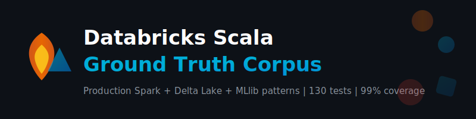

<div align="center">



[](https://github.com/paiml/databricks-scala-ground-truth-corpus/actions/workflows/ci.yml)
[](https://github.com/paiml/databricks-scala-ground-truth-corpus)
[](https://www.scala-lang.org)
[](https://spark.apache.org)
[](https://delta.io)
[](LICENSE)

**Production-ready Scala patterns for Databricks course content**

*Popperian falsification methodology | 130 tests | 99.84% statement coverage | 100% branch coverage*

</div>

---

## Overview

Ground truth corpus implementing idiomatic Scala patterns for Apache Spark, MLlib, Delta Lake, and Structured Streaming on Databricks. Designed as the reference implementation for Databricks certification course material.

| | |
|---|---|
| **Language** | Scala 2.12.20 |
| **Framework** | Apache Spark 3.5.4 + Delta Lake 3.3.0 |
| **Domains** | 4 (Spark, ML, Delta Lake, Streaming) |
| **Source modules** | 14 (110 functions) |
| **Test suites** | 15 (130 tests) |
| **Statement coverage** | 99.84% (enforced >= 95%) |
| **Branch coverage** | 100% |
| **Methodology** | Popperian Falsification + TDD |

---

## Domains

### Domain 1: Spark Fundamentals

| Module | Functions | Patterns |
|--------|-----------|---------|
| `DataFrameOps` | 12 | filter, rename, pivot, unpivot, dedup, flatten struct |
| `SqlOps` | 9 | temp views, parameterized queries, CTAS, EXPLAIN |
| `UdfRegistry` | 7 | PII masking, phone validation, email domain extraction |
| `WindowFunctions` | 9 | rank, dense rank, running sum, moving avg, top-K, ntile |
| `JoinPatterns` | 7 | broadcast, salted skew, SCD Type 2, anti/semi, cross |

### Domain 2: ML/MLflow

| Module | Functions | Patterns |
|--------|-----------|---------|
| `FeatureEngineering` | 7 | OHE, min-max/standard scaling, TF-IDF, mean imputation |
| `PipelineBuilder` | 4 | classification (LR/RF/GBT), regression, preprocessing |
| `ModelEvaluation` | 9 | AUROC, AUPR, F1, RMSE, R2, MAE, classification/regression reports |
| `HyperparamTuning` | 8 | cross-validation, train-val split, evaluator factories |

### Domain 3: Delta Lake

| Module | Functions | Patterns |
|--------|-----------|---------|
| `DeltaTableOps` | 12 | CRUD, MERGE, time travel, vacuum, compaction |
| `ChangeDataCapture` | 5 | CDC detection, SCD Type 1/2 merge, batch CDC apply |
| `SchemaEvolution` | 7 | schema diff, validation, safe evolution, merge/overwrite |

### Domain 4: Structured Streaming

| Module | Functions | Patterns |
|--------|-----------|---------|
| `StreamProcessor` | 10 | rate/file/delta sources, watermarks, deduplication |
| `WindowedAggregation` | 4 | tumbling, sliding, grouped, multi-metric windows |
| `StreamingJoin` | 5 | stream-static, stream-stream, broadcast enrichment |

---

## Quick Start

### Prerequisites

```bash
# Install Scala toolchain via Coursier (JDK 11 + sbt)
curl -fL https://github.com/coursier/coursier/releases/latest/download/cs-x86_64-pc-linux.gz \
  | gzip -d > cs && chmod +x cs && ./cs setup --yes
```

### Build and Test

```bash
git clone https://github.com/paiml/databricks-scala-ground-truth-corpus
cd databricks-scala-ground-truth-corpus

sbt compile          # Compile
sbt test             # Run all 130 tests

# Domain-specific testing
sbt "testOnly com.paiml.databricks.spark.*"
sbt "testOnly com.paiml.databricks.ml.*"
sbt "testOnly com.paiml.databricks.delta.*"
sbt "testOnly com.paiml.databricks.streaming.*"

# Coverage report (95% minimum enforced)
sbt clean coverage test coverageReport
open target/scala-2.12/scoverage-report/index.html
```

### Quality Gates (Certeza Methodology)

```bash
make tier1    # Format check + compile        (<30s)
make tier2    # + all tests                    (<5min)
make tier3    # + coverage (95% enforced)      (<10min)
make tier4    # + scaladoc generation          (full CI)
```

---

## Quality Standards

| Metric | Target | Enforcement |
|--------|--------|-------------|
| Statement coverage | >= 95% | sbt-scoverage `coverageFailOnMinimum` |
| Branch coverage | 100% | sbt-scoverage |
| Cyclomatic complexity | <= 15 | pmat.toml |
| Cognitive complexity | <= 12 | pmat.toml |
| SATD comments | 0 | pmat.toml |
| TDG grade | A | pmat.toml |
| Compiler warnings | 0 | `-Xlint -Ywarn-*` scalac flags |
| Mutation score | >= 80% | pmat.toml |

---

## Repository Structure

```
databricks-scala-ground-truth-corpus/
├── build.sbt                    # sbt build (Spark 3.5.4, Delta 3.3.0)
├── project/
│   ├── build.properties         # sbt 1.10.7
│   └── plugins.sbt              # scoverage, scalafmt, wartremover
├── src/
│   ├── main/scala/com/paiml/databricks/
│   │   ├── spark/               # Domain 1: 5 modules, 44 functions
│   │   ├── ml/                  # Domain 2: 4 modules, 28 functions
│   │   ├── delta/               # Domain 3: 3 modules, 24 functions
│   │   └── streaming/           # Domain 4: 3 modules, 19 functions
│   └── test/scala/com/paiml/databricks/
│       ├── SharedSparkSession.scala  # Shared local[2] SparkSession trait
│       ├── spark/               # 5 spec files
│       ├── ml/                  # 4 spec files
│       ├── delta/               # 3 spec files
│       └── streaming/           # 3 spec files
├── .github/workflows/ci.yml    # GitHub Actions CI (4-gate pipeline)
├── specs/                       # Domain specifications
├── book/                        # mdBook documentation
├── pmat.toml                    # PMAT quality configuration
├── CLAUDE.md                    # Claude Code guidelines
├── QA-CHECKLIST.md              # 130 falsification test cases
└── Makefile                     # Certeza tier quality gates
```

---

## CI Pipeline

The [GitHub Actions workflow](.github/workflows/ci.yml) runs a 4-gate quality pipeline on every push and PR:

| Gate | Check | Threshold |
|------|-------|-----------|
| 1 | Compile (main + test) | Zero errors |
| 2 | All 130 tests | Zero failures |
| 3 | Coverage report | >= 95% statements |
| 4 | Scaladoc generation | Zero warnings |

---

## Technology Stack

| Component | Version | Purpose |
|-----------|---------|---------|
| Scala | 2.12.20 | Language (Spark 3.x compatible) |
| Apache Spark | 3.5.4 | Distributed compute engine |
| Delta Lake | 3.3.0 | ACID table storage |
| ScalaTest | 3.2.19 | Test framework (FlatSpec + Matchers) |
| ScalaCheck | 1.18.1 | Property-based testing |
| sbt-scoverage | 2.2.2 | Code coverage instrumentation |
| sbt-scalafmt | 2.5.2 | Code formatting |
| sbt-wartremover | 3.2.5 | Linting |

---

## References

- [Apache Spark 3.5 Documentation](https://spark.apache.org/docs/3.5.4/)
- [Delta Lake 3.3 Documentation](https://docs.delta.io/3.3.0/)
- [Spark MLlib Guide](https://spark.apache.org/docs/3.5.4/ml-guide.html)
- [Structured Streaming Guide](https://spark.apache.org/docs/3.5.4/structured-streaming-programming-guide.html)
- Popper, K. (1959). *The Logic of Scientific Discovery*

---

## License

Apache 2.0 &mdash; See [LICENSE](LICENSE)
